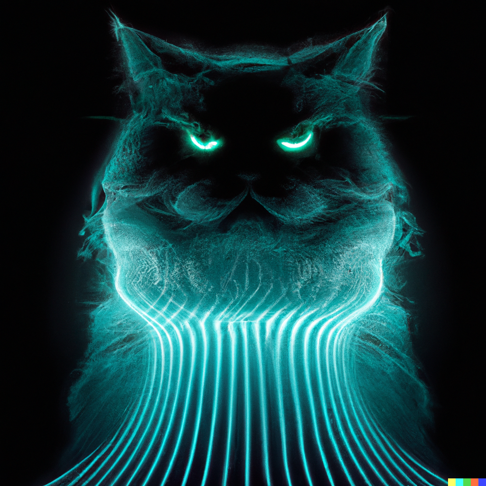

# From spectrogram to meow.

Using neural networks on raw audio waveforms is hard, because they contain so many datapoints. Therefore, we usually transform the waveform to an image - the spectrogram. The spectrogram is then used as input for neural networks to process sound. However, it's somewhat tricky to go recover an actual sound waveform from a spectrogram because some information is lost in the transformation process. In [neural_vocoder.ipynb](https://github.com/mastoffel/neural_vocoder/blob/main/neural_vocoder.ipynb), I'll train a convolutional neural network (CNN) to infer cat meow waveforms from spectrograms. The aim is to use a simpler architecture than cutting edge models, whilst still giving decent results.

Dall-e prompt "A stern looking cat wearing a futuristic glowing waveform".
